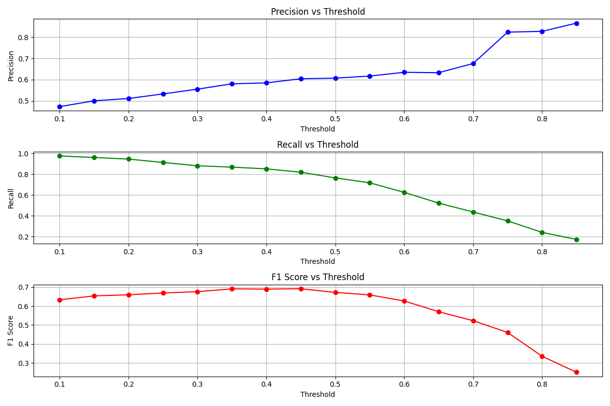

# Heart Disease Detection Using CNN

This project aims to develop a Convolutional Neural Network (CNN) for the multi-label classification of heart disease using the BMD-HS dataset. The goal is to identify positive cases of heart disease with high recall while maintaining a balance with precision.

## Dataset
The BMD-HS dataset contains over 800 heart sound recordings classified into six categories, including common valvular diseases and healthy samples. The dataset includes multi-label annotations, echocardiographic data, and rich metadata.

## Key Features
- **Multi-label annotations**: Capture unique disease states.
- **Echocardiographic data**: Provide additional diagnostic context.
- **Diverse demographic representation**: Gender-balanced collection.
- **Balanced class representation**: Address class imbalance issues.
- **Rich metadata**: Enable in-depth research and potential discovery of new correlations.
- **Multi-disease data**: Reflect real-world scenarios with multiple valvular diseases.

## Project Structure
- **data**: Contains the dataset files.
- **images**: Contains images of feature maps and threshold graphs.
- **src**: Contains the source code files.

## Methodology

### Data Preparation
- **Preprocessing**: Applied various preprocessing techniques to clean and normalize the data.
- **Data Augmentation**: Initially applied data augmentation techniques but found that it introduced noise, leading to suboptimal results. Therefore, data augmentation was not used in the final model.

### Model Architecture
- **CNN Model**: Developed a CNN model optimized using the Optuna TPE algorithm.
- **Hyperparameter Tuning**: Used Optuna's TPE algorithm to maximize the F1 score, balancing recall and precision.
- **Early Stopping**: Implemented early stopping with a patience of 20 to monitor validation loss and restore the best weights.

### Training
- **Class Imbalance Handling**: Used sample weights to balance the dataset during training.
- **Evaluation Metrics**: Calculated weighted F1 score during training and macro F1 score after applying sample weights.

### Custom Metrics
Due to the deprecation of TensorFlow Addons (TFA), I created custom implementations for the F1 score and Hamming loss. These custom metrics were essential for evaluating the model's performance in a multi-label classification setting.

### Evaluation
- **Threshold Optimization**: Found the best threshold to maximize the F1 score, balancing recall and precision.

### Reasoning and Analysis

In this project, the primary goal was to identify all positive labels as accurately as possible. Given the critical nature of heart disease diagnosis, it was essential to prioritize recall (sensitivity) to ensure that all potential cases of heart disease were identified, even if it meant sacrificing some precision. This approach minimizes the risk of missing a true positive case, which could have severe consequences for patient health.

To achieve this, I implemented the Optuna TPE algorithm to maximize the F1 score, which balances recall and precision. The F1 score was chosen as the optimization metric because it provides a harmonic mean of precision and recall, ensuring that both metrics are considered.

During training, I applied an early stopping callback to monitor the validation loss and stop training if the model stopped improving, with a patience of 20 epochs. This helped prevent overfitting and ensured that the model could generalize well to the validation dataset.

I initially experimented with data augmentation techniques to increase the diversity of the training data. However, I found that data augmentation introduced noise and led to suboptimal results. Therefore, I decided to train the model without data augmentation, which yielded better performance.

One significant challenge was the imbalanced nature of the dataset. To address this, I used a weighted average for the F1 score during training, as it is less impacted by class imbalance compared to macro or micro averages. Additionally, I calculated sample weights to balance the dataset during training. After training, I used the macro average for the F1 score, as it is more appropriate when the dataset is balanced.

After training the model, I evaluated its performance on the validation dataset and created a function to find the best threshold that maximized the F1 score. This further helped in identifying more positive cases while maintaining a balance with precision, which is crucial in the medical field.

Given the multi-label nature of the task, several challenges arose during the project, leading to lower metric results. However, by applying the techniques described above, I was able to create a more effective model for heart disease detection.

## Results

| Metric       | Value Before Threshold Optimization | Value After Threshold Optimization |
|--------------|-------------------------------------|------------------------------------|
| **AUC**      | 0.8166                              | 0.8166                             |
| **F1 Score** | 0.6773                              | 0.6914                             |
| **Loss**     | 0.4689                              | 0.4689                             |
| **Precision**| 0.5872                              | 0.6039                             |
| **Recall**   | 0.7678                              | 0.8184                             |
| **Threshold**| -                                   | 0.45                               |

## Model Performance Metrics

| Metric       | Value  | Description                                                                                 |
|--------------|--------|---------------------------------------------------------------------------------------------|
| **AUC**      | 0.8166 | Measures the ability to distinguish between classes. Higher values indicate better performance. |
| **F1 Score** | 0.6914 | Harmonic mean of precision and recall, reflecting a balance between identifying positives and minimizing false positives. |
| **Loss**     | 0.4689 | Measures error in predictions. Lower loss indicates better performance.                      |
| **Precision**| 0.6039 | Proportion of true positive predictions among all positive predictions.                     |
| **Recall**   | 0.8184 | Proportion of true positive predictions among all actual positive cases.                    |
| **Threshold**| 0.45   | Probability cutoff for classifying cases as positive, balancing precision and recall.        |

### Interpretation of Metrics
- **High Recall (0.8184)**: In the context of heart disease detection, recall is of paramount importance. A high recall value of 81.84% means that the model is highly effective at identifying true positive cases of heart disease. This is crucial because missing a positive case (false negative) can have severe consequences, such as a patient with heart disease not receiving the necessary treatment. By achieving a high recall, the model ensures that most patients with heart disease are correctly identified, which is vital for timely and accurate diagnosis.

- **Balanced Precision (0.6039)**: Precision measures the proportion of true positive predictions among all positive predictions. A precision of 60.39% indicates that while the model is good at identifying positive cases, there is still a significant proportion of false positives. In medical diagnostics, this is acceptable because it is better to have false positives (healthy individuals incorrectly identified as having heart disease) than false negatives. False positives can be further evaluated through additional tests, whereas false negatives could lead to missed diagnoses and untreated conditions.

- **Optimal F1 Score (0.6914)**: The F1 score is the harmonic mean of precision and recall, providing a balance between the two metrics. An F1 score of 0.6914 reflects a strong balance between identifying positive cases and minimizing false positives. This balance is essential in medical applications where both high recall and reasonable precision are necessary to ensure that patients receive appropriate care without overwhelming the healthcare system with false alarms.

- **AUC (0.8166)**: The Area Under the Curve (AUC) measures the model's ability to distinguish between classes. An AUC of 0.8166 indicates that the model has a strong ability to differentiate between heart disease and healthy cases. A higher AUC value means better performance, as it shows that the model can effectively separate positive cases from negative ones. This is crucial for a reliable diagnostic tool, as it ensures that the model can accurately identify patients with heart disease.

- **Loss (0.4689)**: The loss metric measures the error in the model's predictions. A lower loss value indicates better performance. A loss of 0.4689 means that the model's predictions are relatively accurate, with fewer errors in classifying heart disease cases. This is important for ensuring that the model's predictions are reliable and can be trusted in a clinical setting.

- **Best Threshold (0.45)**: The best threshold is the probability cutoff for classifying cases as positive. A threshold of 0.45 means that predictions with a probability above 0.45 are classified as positive cases. This threshold was chosen to balance recall and precision, achieving the best F1 score. By optimizing the threshold, the model can better balance the trade-off between identifying true positive cases and minimizing false positives, which is critical for effective heart disease diagnosis.

### Visualizations
Below are visualizations that illustrate the model's performance:

- **Precision vs Threshold**
- **Recall vs Threshold**
- **F1 Score vs Threshold**



## Files

| File Name                  | Description                                     |
|----------------------------|-------------------------------------------------|
| **HyperPTuning.py**        | Hyperparameter tuning using Optuna.             |
| **cnn_model.py**           | CNN model architecture.                         |
| **custom_f1_score.py**     | Custom F1 score implementation.                 |
| **custom_hamming_loss.py** | Custom Hamming loss implementation.             |
| **data_augmentation.py**   | Data augmentation techniques.                   |
| **data_preparation.py**    | Data preparation and preprocessing.             |
| **model_info.py**          | Model information and summary.                  |
| **optuna_best_params.py**  | Best hyperparameters from Optuna.               |
| **sample_weights.py**      | Calculation of sample weights.                  |

## Conclusion
This project demonstrates the application of CNNs for heart disease detection with a focus on maximizing recall while balancing precision. The use of Optuna for hyperparameter tuning and sample weights for handling class imbalance were key to achieving the results.

## Requirements
- Python 3.17
- TensorFlow
- Optuna
- Numpy
- Pandas
- Matplotlib
- Scikit-learn

## Acknowledgements
This project uses the BMD-HS dataset. If this dataset helped your research, please cite the following paper:

Ali, S. N., et al. (2024). BUET Multi-disease Heart Sound Dataset: A Comprehensive Auscultation Dataset for Developing Computer-Aided Diagnostic Systems. arXiv preprint arXiv:2409.00724.

## Installation
```bash
pip install -r requirements.txt
